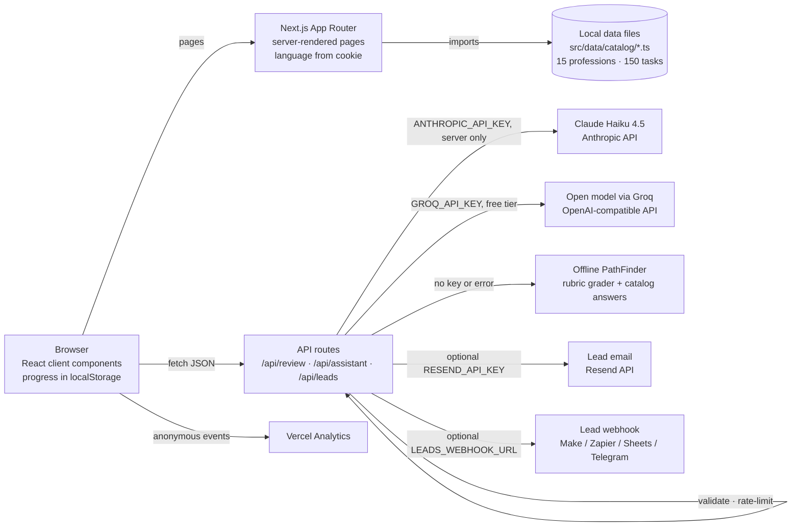

# PathTry — try a profession before you choose it

**Live demo:** https://venture-hack-project1-0-e8gi.vercel.app/

PathTry is a micro career-exploration service. In about ten minutes a student works through ten realistic tasks from a profession, gets feedback from an AI mentor, and sees whether the work actually fits them — before committing years to a university major. The site is fully bilingual (English and Russian).

## Problem

Students choose a major from descriptions, rankings, and advice from relatives. Almost nobody gets to try the actual work first. Many only realise a career is not for them in the second or third year of study, after losing time and money. Internships and job shadowing are rare for teenagers, and personality quizzes do not show what a normal working day looks like.

## Solution

Short, low-stakes work simulations. Each profession has ten tasks built from real work activities described in O*NET and ESCO: seven decisions and three written answers. After every step the student sees how a professional would think, rates how the task felt, and at the end gets a match score, strengths, and a roadmap of next steps.

## Features

- **15 professions in 4 fields, 150 tasks** — Tech & Data, Healthcare & Science, Creative & Media, Humanities & Law; filterable catalogue with badges.
- **Local exams** — every profession lists the Kazakhstan UNT (ЕНТ) subject pair next to international options (SAT, A-Levels, IB, IELTS).
- **Realistic tasks** — 5 plausible options per question, shuffled so the correct answer is never in a fixed position.
- **Pro insight** — after each choice, a short expert comment on why professionals act that way.
- **PathFinder AI mentor** — reviews written answers against task criteria (strong / partial / off the task), gives hints without spoilers, shows an expert sample answer, and answers career questions with the current task in context.
- **Interest & energy meter** — students rate each task (energising / neutral / draining), so the result reflects fit, not just correctness.
- **Result dashboard** — match %, skill radar, strengths, subjects, majors, next steps, a related profession, share link, Save as PDF, and a one-tap "Did this change how you see this profession?" question.
- **Lead capture** — personal roadmap request (email or Telegram) and a partner form for universities and EdTech.
- **Bilingual and mobile-first** — server-rendered in the visitor's language (cookie or browser language), no flash of the other language.
- **Privacy by design** — no sign-up; progress stays in the browser.

## User flow

1. Open the home page and start the featured experiment in one click, or filter the catalogue.
2. Work through 10 tasks. Use "Hint from PathFinder" or ask PathFinder in the chat when stuck.
3. After each answer, read the pro insight (or PathFinder's review for written answers) and rate how the task felt.
4. See the result: match %, strengths, next steps. Share it, save it as PDF, or request a personal roadmap.
5. Try a related profession and compare where your energy was higher.

## Architecture



- **Content** lives in typed local files (`src/data/catalog/*.ts`), each string stored as an `[English, Russian]` pair. The server loads the catalogue; client pages receive only the one profession they show.
- **Grading criteria and reference answers** are read on the server from the catalogue, never trusted from the client.
- **PathFinder** tries providers in order: Claude (official Anthropic SDK, structured JSON output), then a free open model through Groq's OpenAI-compatible API (JSON mode, validated with Zod), then an offline rubric grader and catalogue-based answer engine — so the app always works.

## Tech stack

Next.js 15 (App Router) · React 19 · TypeScript · Tailwind CSS 4 + custom CSS · Anthropic TypeScript SDK (`@anthropic-ai/sdk`) with Zod structured outputs · Vercel hosting and Vercel Analytics.

## Security measures

- AI keys live only in server-side environment variables (`ANTHROPIC_API_KEY`, `GROQ_API_KEY`); no key or provider call ever reaches client code.
- Every API route validates input types and lengths, rejects messages over 1,000 characters, keeps at most 10 chat messages of history, and caps request bodies at 20 KB.
- In-memory rate limiting per IP: 20 requests/min for PathFinder and grading, 5/min for lead forms.
- Error responses are generic; stack traces and provider errors are only written to server logs.
- PathFinder's system prompt restricts it to careers and studying, refuses harmful or off-topic requests, answers crises with a referral to trusted adults and helplines, and never presents medical, legal, or financial information as real advice. Student text is treated as data, not instructions.
- Lead forms use server-side validation and a honeypot field; contact details are not written to logs.
- No accounts and no database: progress and results stay in the browser's localStorage.

## AI tools used

- **In the product:** PathFinder's reviews and chat run on Claude Haiku 4.5 (Anthropic) or, on the free setup, an open model served by Groq.
- **In development:** Claude Code (Anthropic) was used as a coding assistant for implementation, content drafting (bilingual tasks), testing, and documentation. All content and code were reviewed by the team.

## Run locally

Requires Node.js 20+.

```bash
npm install
npm run dev
```

Open http://localhost:3000. Production build: `npm run build && npm start`.

### Quality checks

```bash
npm run lint       # ESLint (Next.js core-web-vitals + TypeScript rules)
npm run test:e2e   # plays all 15 professions in headless Chrome (dev server must be running)
```

The end-to-end test answers every task, waits for PathFinder's review, and fails on broken steps, console errors, horizontal overflow on a 390 px phone screen, or untranslated English text in Russian mode. Options: `LANG_UI=en`, `WIDTH=1280`, `BASE_URL=https://…`, `SLUGS=doctor,nurse`, `CHROME_PATH=…` (Node.js 22+).

## Environment variables

| Variable | Required | Purpose |
| --- | --- | --- |
| `ANTHROPIC_API_KEY` | No | PathFinder on Claude Haiku 4.5 (paid, used first when set). |
| `GROQ_API_KEY` | No | Free alternative: PathFinder on an open model via Groq's free tier (no card needed, key at console.groq.com). Several models are tried automatically; set `FREE_AI_MODEL` to pick one. |
| `FREE_AI_API_KEY`, `FREE_AI_BASE_URL`, `FREE_AI_MODEL` | No | Any other OpenAI-compatible provider instead of Groq (e.g. Gemini: `https://generativelanguage.googleapis.com/v1beta/openai`, model `gemini-2.5-flash`). |
| `RESEND_API_KEY`, `LEADS_EMAIL_TO` | No | Roadmap and partner requests arrive by email via [Resend](https://resend.com) (free tier). `LEADS_EMAIL_TO` is the inbox (comma-separated for several). Without a verified domain, Resend only delivers to the email the Resend account was created with; set `LEADS_EMAIL_FROM` once a domain is verified. |
| `LEADS_WEBHOOK_URL` | No | Roadmap and partner requests are POSTed here as JSON (Make, Zapier, Google Apps Script, a Telegram bot…). Without email or a webhook, only anonymous lead metadata is logged. |

With no AI key at all, PathFinder still works: answers are graded against task criteria and the chat answers from the catalogue.

Set them in `.env.local` locally or under the Vercel project's Environment Variables, then redeploy. Enable Web Analytics in the Vercel dashboard to see page views and the custom events `experiment_started`, `experiment_completed`, and `feedback_answer`.

## Data sources

- [O*NET OnLine](https://www.onetonline.org/) — US Department of Labor occupational database (work activities, skills).
- [ESCO](https://esco.ec.europa.eu/) — European Skills, Competences, Qualifications and Occupations taxonomy.

Tasks are simplified, rewritten scenarios for students. PathTry is an exploration tool, not a psychological test or a prediction of career success.

## Project structure

```
src/app/            pages (home, /try/[slug], /result/[slug], /about) and API routes
src/components/     UI components (TaskRunner, ResultClient, PathFinder chat, LeadCapture…)
src/data/catalog/   bilingual profession and task content
src/lib/            PathFinder (Claude + offline), grader, security, lead validation
```

## Team

| Name | Role |
| --- | --- |
| **Tair Idrissov** ([@tairidrisov33-cmd](https://github.com/tairidrisov33-cmd)) | Team Captain · Lead Developer — built most of the product |
| **Damir Omar** | Web Developer |
| **Amelya Leonova** | Pitch & Presentation Lead |
| **Arlan Sharipov** | Pitch Co-author |
