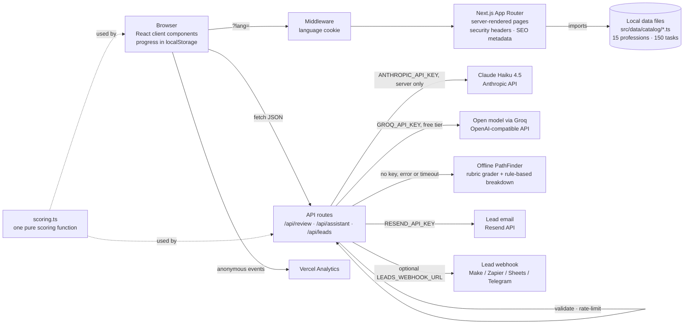

# PathTry — try a profession before you choose it

**Live demo:** https://pathtry.site · VentureHack 2026, Track 2 (EduTech)

PathTry is a micro career-exploration service for school students. In about ten minutes a student works through ten realistic tasks from a profession, gets feedback from an AI mentor, and sees whether the work actually fits them — before committing years to a university major. The site is fully bilingual (English and Russian).

## Problem

Students choose a major from descriptions, rankings, and advice from relatives. Almost nobody gets to try the actual work first.

- **68.7%** of 2025 university graduates in Kazakhstan were employed by June 2026 (75.2% a year earlier) — MSHE RK via [Tengrinews, 17 Sep 2026](https://tengrinews.kz/educationscience/kazahstan-tratit-milliardyi-studentov-pochemu-tsifryi-607508/).
- **~40%** of 40,000+ surveyed school students say schools lack career-guidance opportunities — [Tengrinews, 2024](https://tengrinews.kz/kazakhstan_news/kazahstanskie-shkolniki-podelilis-karernyimi-ojidaniyami-529757/).
- **39%** of key job skills are expected to change by 2030 — [WEF Future of Jobs Report 2025](https://www.weforum.org/publications/the-future-of-jobs-report-2025/).

Internships and job shadowing are rare for teenagers, and personality quizzes do not show what a normal working day looks like.

## Solution

Short, low-stakes work simulations — not a test, a trial of real work. Each profession has ten tasks built from real work activities described in O*NET and ESCO: seven decisions and three written answers. After every step the student sees how a professional would think, rates how the task felt, and at the end gets a match score, strengths, a personal PathFinder breakdown, and next steps.

| | Personality tests | Internships | **PathTry** |
| --- | :---: | :---: | :---: |
| Real work tasks | — | ✓ | ✓ |
| Takes 10 minutes | ✓ | — | ✓ |
| Made for school students | ✓ | — | ✓ |
| AI mentor feedback | — | — | ✓ |
| Free & no sign-up | partly | — | ✓ |

## Features

- **15 professions in 4 fields, 150 tasks** — Tech & Data, Healthcare & Science, Creative & Media, Humanities & Law; filterable catalogue with badges.
- **Realistic tasks** — 5 plausible options per question, shuffled so the correct answer is never in a fixed position.
- **Local exams** — every profession lists the Kazakhstan UNT (ЕНТ) subject pair next to international options (SAT, A-Levels, IB, IELTS).
- **Pro insight** — after each choice, a short expert comment on why professionals act that way.
- **PathFinder AI mentor** — reviews written answers generously (it is a taster, not an exam), gives hints without spoilers, shows an expert sample answer, answers career questions with the current task in context, and writes a personal 3–4 sentence breakdown of the result.
- **Interest & energy meter** — students rate each task (energising / neutral / draining); the result shows energy "based on N of 10 tasks", or "Not rated".
- **Result dashboard** — pro moves, match %, verdict, skill radar, strengths, subjects, majors, next steps, a related profession, share link, result card with QR code, Save as PDF, and a one-tap "Did this change how you see this profession?" question. Unfinished runs are clearly marked as preliminary.
- **Lead capture** — personal roadmap request (email or Telegram) and a partner form for universities and EdTech, delivered by email (Resend) and/or webhook.
- **Bilingual and mobile-first** — server-rendered in the visitor's language (`?lang=`, cookie, or browser language), no flash of the other language; tested at 360–1440 px.
- **Privacy by design** — no sign-up; progress stays in the browser.

## User flow

1. Open the home page and start the featured experiment in one click, or filter the catalogue.
2. Work through 10 tasks. Use "Hint from PathFinder" or ask PathFinder in the chat when stuck.
3. After each answer, read the pro insight (or PathFinder's review for written answers) and rate how the task felt.
4. See the result: pro moves, match %, strengths, PathFinder's breakdown, next steps. Share it, save it as PDF, or request a personal roadmap.
5. Try a related profession and compare where your energy was higher.

## Architecture



- **Content** lives in typed local files (`src/data/catalog/*.ts`), each string stored as an `[English, Russian]` pair. The server loads the catalogue; client pages receive only the one profession they show.
- **Scoring** is one pure function, `scoreExperiment()` in `src/lib/scoring.ts`: it turns saved answers into pro moves, match %, energy, verdict, strengths, and per-step status. The result page, share card, PDF, and the PathFinder breakdown all use it, so the numbers always agree. The server recomputes it from the catalogue before calling the AI.
- **Grading criteria and reference answers** are read on the server from the catalogue, never trusted from the client.
- **PathFinder** tries providers in order: Claude (official Anthropic SDK, structured JSON output), then a free open model through Groq's OpenAI-compatible API (JSON mode, validated with Zod), then an offline rubric grader and rule-based breakdown — so the app always works. The result breakdown has a 10-second client timeout and never loads forever.

## Tech stack

Next.js 15 (App Router, middleware, metadata routes, `next/og`) · React 19 · TypeScript · Tailwind CSS 4 + custom CSS · Anthropic TypeScript SDK (`@anthropic-ai/sdk`) with Zod structured outputs · Resend (email) · Vitest · ESLint · Vercel hosting and Vercel Analytics.

## Security

- **HTTP headers on every route** (`next.config.ts`): `Content-Security-Policy` (self, Google Fonts, Vercel Analytics only; `frame-ancestors 'none'`, `object-src 'none'`, `base-uri 'self'`, `form-action 'self'`), `X-Content-Type-Options: nosniff`, `Referrer-Policy: strict-origin-when-cross-origin`, `X-Frame-Options: DENY`, `Permissions-Policy: camera=(), microphone=(), geolocation=()`, `Strict-Transport-Security`; `X-Powered-By` removed.
- **Secrets** live only in server-side environment variables (`ANTHROPIC_API_KEY`, `GROQ_API_KEY`, `RESEND_API_KEY`, `LEADS_WEBHOOK_URL`); no key, webhook URL, or provider call ever reaches client code.
- **Input validation** on every API route: types, lengths and allowed values are checked; messages over 1,000 characters are rejected; chat history is capped at 10 messages; request bodies are capped at 20 KB; result breakdown requests accept only known task ids, scores in 0–1, and known ratings.
- **Rate limiting per IP** (in-memory sliding window): 20 requests/min for PathFinder chat and breakdown, 20/min for answer review, 5/min for lead forms.
- **Lead forms**: server-side email/Telegram validation, max lengths, a required consent checkbox (enforced on the server), a honeypot field, and clear success/error states; contact details are never written to logs.
- **Safe errors**: responses are generic; stack traces and provider errors are only written to server logs.
- **AI safety**: PathFinder's system prompt restricts it to careers and studying, refuses harmful or off-topic requests, answers crises with a referral to trusted adults and helplines, and never presents medical, legal, or financial information as real advice. Student text is treated as data, not instructions, and task options are never sent to the model before the student answers.
- **No accounts and no database**: progress and results stay in the browser's localStorage.

## SEO & sharing

- `robots.txt` (result pages disallowed) and `sitemap.xml` with every profession and `hreflang` alternates.
- Canonical URLs, `hreflang` en/ru/x-default (`?lang=en|ru`), Open Graph and Twitter cards with `metadataBase` https://pathtry.site.
- Generated 1200×630 preview images: one for the site and one per profession ("Try being a Doctor in 10 minutes").
- `favicon.ico`, `apple-icon.png`, and a web app manifest with 192/512 and maskable icons. Result pages are `noindex`.

## Validation

`src/data/validation.ts` holds the results of testing PathTry with real students: number of testers, understanding before/after, % who learned something new, % who realised a profession is not for them, realism and usability scores, and quotes. The "Tested with real students" section on the home and About pages appears **only when `testers > 0`**, and each number is shown only when it is filled in — the site never shows placeholder or estimated numbers.

## AI tools used

- **In the product:** PathFinder's reviews, chat, and result breakdown run on Claude Haiku 4.5 (Anthropic) or, on the free setup, an open model served by Groq.
- **In development:** Claude Code (Anthropic) was used as a coding assistant for implementation, content drafting (bilingual tasks), testing, and documentation. All content and code were reviewed by the team.

## Run locally

Requires Node.js 20+.

```bash
npm install
npm run dev
```

Open http://localhost:3000. Production build: `npm run build && npm start`.

## Testing

```bash
npm run lint       # ESLint (Next.js core-web-vitals + TypeScript rules)
npm test           # Vitest unit tests: scoring (all-correct, none-correct, unfinished, mixed with written answers, tampered storage) and answer grading
npm run test:e2e   # plays all 15 professions in headless Chrome (a dev or production server must be running)
```

The end-to-end test answers every task, waits for PathFinder's review, and fails on broken steps, console errors (including CSP violations), horizontal overflow, untranslated English text in Russian mode, tap targets under 40 px on phones, a result that shows 0 for an unfinished run with pro moves, or a PathFinder breakdown that is still loading after 12 seconds. Options: `LANG_UI=en`, `WIDTH=1280`, `BASE_URL=https://…`, `SLUGS=doctor,nurse`, `CHROME_PATH=…` (Node.js 22+).

## Environment variables

| Variable | Required | Purpose |
| --- | --- | --- |
| `ANTHROPIC_API_KEY` | No | PathFinder on Claude Haiku 4.5 (paid, used first when set). |
| `GROQ_API_KEY` | No | Free alternative: PathFinder on an open model via Groq's free tier (no card needed, key at console.groq.com). Several models are tried automatically; set `FREE_AI_MODEL` to pick one. |
| `FREE_AI_API_KEY`, `FREE_AI_BASE_URL`, `FREE_AI_MODEL` | No | Any other OpenAI-compatible provider instead of Groq (e.g. Gemini: `https://generativelanguage.googleapis.com/v1beta/openai`, model `gemini-2.5-flash`). |
| `RESEND_API_KEY`, `LEADS_EMAIL_TO`, `LEADS_EMAIL_FROM` | No | Roadmap and partner requests arrive by email via [Resend](https://resend.com). `LEADS_EMAIL_TO` is the inbox (comma-separated for several); `LEADS_EMAIL_FROM` is a sender on a domain verified in Resend. |
| `GOOGLE_SITE_VERIFICATION`, `YANDEX_VERIFICATION` | No | Verification codes from Google Search Console and Yandex Webmaster (HTML tag method); rendered as meta tags on every page. |
| `LEADS_WEBHOOK_URL` | No | Roadmap and partner requests are also POSTed here as JSON (Make, Zapier, Google Apps Script, a Telegram bot…). Without email or a webhook, only anonymous lead metadata is logged. |

With no AI key at all, PathFinder still works: answers are graded against task criteria, the chat answers from the catalogue, and the result breakdown is built from the score.

Set them in `.env.local` locally or under the Vercel project's Environment Variables, then redeploy. Vercel Web Analytics records page views and the custom events `experiment_started`, `experiment_completed`, and `feedback_answer`.

## Roadmap & business model

- **Now:** 15 professions, English and Russian, PathFinder AI.
- **Next:** 50+ professions, Kazakh language, a dashboard for school career counsellors.
- **Later:** university programme matching, challenges from real employers.

Free for students. Universities, schools, and EdTech companies pay for anonymous interest analytics, branded experiments built around their programmes, and pilots.

## Data sources

- [O*NET OnLine](https://www.onetonline.org/) — US Department of Labor occupational database (work activities, skills).
- [ESCO](https://esco.ec.europa.eu/) — European Skills, Competences, Qualifications and Occupations taxonomy.

Tasks are simplified, rewritten scenarios for students. PathTry is an exploration tool, not a psychological test or a prediction of career success.

## Project structure

```
src/app/            pages (home, /try/[slug], /result/[slug], /about), API routes, robots, sitemap, manifest, OG images
src/components/     UI components (TaskRunner, ResultClient, PathFinder chat, LeadCapture, evidence sections…)
src/data/           bilingual profession catalogue, translations, validation results
src/lib/            scoring, PathFinder (Claude + Groq + offline), grader, security, SEO helpers
src/middleware.ts   ?lang= handling
scripts/e2e.mjs     end-to-end test in headless Chrome
```

## Team

| Name | Role |
| --- | --- |
| **Tair Idrissov** ([@tairidrisov33-cmd](https://github.com/tairidrisov33-cmd)) | Captain & lead developer |
| **Damir Omar** | Web developer |
| **Amelya Leonova** | Pitch & presentation lead |
| **Arlan Sharipov** | Pitch co-author |
